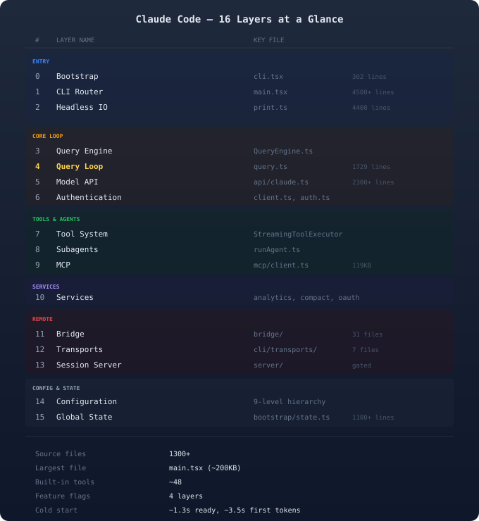
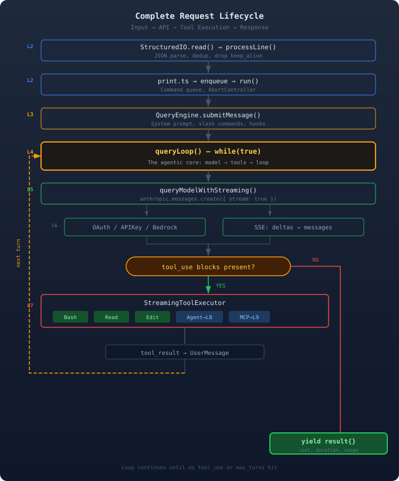
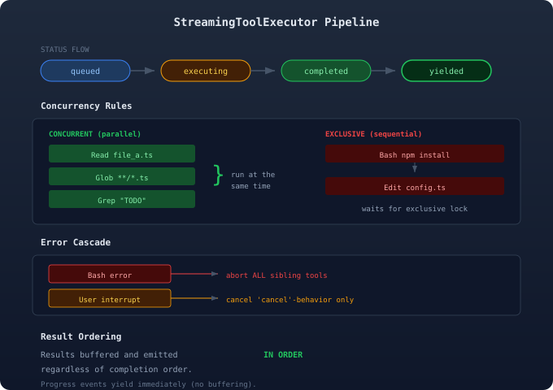

**TL;DR** Claude Code is a TypeScript CLI with 1300+ modules that compiles with Bun and ships as a single binary. This article maps its 16 architectural layers from source: bootstrap fast paths, the agentic `while(true)` loop, subagents as nested function calls (not subprocesses), and four layers of feature flags. All findings come from reading every file in the `claude-code/` source tree.

---

## Why Map the Architecture?

Claude Code ships as a source-available npm package, but the codebase is large and tightly interconnected. The `main.tsx` file alone is 4500+ lines, and the API client is 2300+ lines. Following one user message from stdin to API call to tool execution requires tracing at least seven layers of indirection.

This article organizes that full-file read into a layered map. The goal is a practical mental model you can use while reading source, building extensions, or debugging behavior.



---

## Layer 0: Bootstrap — The Fast-Path Strategy

**File:** `entrypoints/cli.tsx` (302 lines)

This is the single entry point for all CLI invocations. The key design choice is to **check special flags before importing anything**. The full CLI loads 1300+ modules, Commander.js, and Ink. For commands like `--version`, that startup work would be wasted.

The `main()` function implements a decision tree of 8+ fast paths that execute and exit before the heavy imports ever run:


Three fast paths stand out:

- **`--version`** does zero imports. It reads a compile-time macro and prints it. Instant.
- **`--daemon-worker`** is marked as performance-critical and skips even config initialization.
- **`--worktree + --tmux`** calls `exec()` directly into a tmux session, bypassing the CLI entirely.

Only when no fast path matches does bootstrap call `startCapturingEarlyInput()` (to buffer keystrokes during load) and `import('./main.tsx')`.

### Initialization Sequence

After bootstrap, `init()` runs once (memoized) and performs 18 ordered steps:

```
init() — Execution Order:
  1. enableConfigs()
  2. applySafeConfigEnvironmentVariables()
  3. applyExtraCACertsFromConfig()
  4. setupGracefulShutdown()
  5. initialize1PEventLogging()     [async]
  6. populateOAuthAccountInfo()     [async]
  7. initJetBrainsDetection()       [async]
  8. detectCurrentRepository()      [async]
  9. initRemoteManagedSettings()    [cond]
 10. recordFirstStartTime()
 11. configureGlobalMTLS()
 12. configureGlobalAgents()        [proxy]
 13. preconnectAnthropicApi()       [async]
 14. initUpstreamProxy()            [if CCR]
 15. setShellIfWindows()
 16. registerCleanup(shutdownLsp)
 17. registerCleanup(cleanupTeams)
 18. ensureScratchpadDir()          [if on]
```

The order matters. CA certificates must load before network calls. Proxy setup must happen before API pre-connect. Async steps overlap with MCP server connections to keep startup low (~500ms for init, ~1.3s to ready).

---

## Layer 1: CLI Command Router

**File:** `main.tsx` (4500+ lines)

This is the largest file in the codebase. It has three responsibilities: side-effect imports for parallel prefetch, Commander.js option registration, and mode dispatch.

### Side-Effect Imports

Before any function runs, `main.tsx` starts parallel background work:

```
startMdmRawRead()       — macOS MDM subprocess
startKeychainPrefetch() — keychain read
```

These run concurrently with initialization, so results are often cached by the first user message.

### 70+ CLI Flags

Commander registers roughly 70 public flags and 30 hidden flags:

- **Core:** `-p/--print`, `--model`, `--verbose`
- **Session:** `-c/--continue`, `-r/--resume`, `--session-id`
- **System prompt:** `--system-prompt`, `--append-system-prompt`
- **Tools:** `--allowed-tools`, `--disallowed-tools`, `--permission-mode`
- **Budget:** `--max-turns`, `--max-budget-usd`
- **SDK:** `--sdk-url` [hidden], `--output-format stream-json`

Subcommand registration is **skipped entirely in `-p` (print) mode**, saving roughly 65ms. That matters in headless and SDK flows where startup latency is user-visible.

### Mode Dispatch

After parsing, a decision tree selects one execution mode:

```
--continue?  → Load recent conversation → REPL
cc:// URL?   → createDirectConnectSession()
--resume?    → Load conversation, fork? → REPL
--print?     → runHeadless() (print.ts)
[default]    → Interactive REPL (Ink TUI)
```

---

## Layer 2: Headless Execution and Structured IO

**Files:** `cli/print.ts` (4400 lines), `cli/structuredIO.ts` (660 lines)

This layer implements the NDJSON (newline-delimited JSON) protocol for headless (`--print`) mode and SDK integrations.

### The Message Pipeline

```
STDIN (raw bytes)
  → StructuredIO.read()   — async generator
  → processLine()         — JSON parse
  → yield StdinMessage
  → print.ts loop         — dispatch by type
```

`processLine()` silently drops `keep_alive` messages, applies `update_environment_variables` to `process.env`, and deduplicates `control_response` messages with a set capped at 1000 entries.

The message loop in `print.ts` handles 15+ control request subtypes:

- **`interrupt`** — abort the current turn
- **`end_session`** — break the loop, shut down
- **`initialize`** — set up MCP, emit init response
- **`set_model`** — swap the model mid-session
- **`mcp_set_servers`** — reconfigure MCP servers live

### The Permission Flow

When a tool needs user approval, `StructuredIO` implements a race between two permission sources:

```
hookPromise = executePermissionRequestHooks()
sdkPromise  = sendRequest('can_use_tool')
winner      = Promise.race([hook, sdk])
```

The first to resolve wins; the loser is canceled. This lets CLI hooks and SDK permission UIs coexist without blocking each other.

---

## Layer 3: Query Engine

**File:** `QueryEngine.ts`

The Query Engine owns conversation state and orchestrates a single user turn. It sits between the IO layer and the agentic loop, handling slash command parsing, system prompt assembly, and message normalization.

### Key State

```typescript
class QueryEngine {
  mutableMessages: Message[]
  totalUsage: NonNullableUsage
  permissionDenials: SDKPermissionDenial[]
  discoveredSkillNames: Set<string>
  loadedNestedMemoryPaths: Set<string>
}
```

`mutableMessages` is the conversation history, mutated in place. This is deliberate: copying large arrays each turn would be expensive, and the Query Engine is the single owner.

### submitMessage() Flow

1. Wrap `canUseTool` to track permission denials
2. Build system prompt: default + memory + append
3. Process user input (slash commands, file attachments, hooks)
4. Yield system init message (tools, commands, agents)
5. Delegate to `query()` — the agentic loop
6. Normalize and yield each message from the loop
7. Yield a final result with cost, duration, and usage

---

## Layer 4: The Query Loop — The Agentic Core

**File:** `query.ts` (1729 lines)

This is the heart of Claude Code: a `while(true)` loop that calls the model, executes requested tools, and feeds results into the next iteration. The loop continues until the model stops requesting tools or a budget limit is reached.



### State Machine

Each iteration carries forward a state object:

```typescript
type State = {
  messages: Message[]
  toolUseContext: ToolUseContext
  autoCompactTracking
  maxOutputTokensRecoveryCount: number
  hasAttemptedReactiveCompact: boolean
  pendingToolUseSummary: Promise<...>
  stopHookActive: boolean | undefined
  turnCount: number
  transition: Continue | undefined
}
```

`maxOutputTokensRecoveryCount` allows up to 3 retries when the model hits its output token limit. `pendingToolUseSummary` is a promise for a Haiku summary of the previous turn's tool usage. It runs asynchronously during the next model call to overlap compute.

### The Loop

Each iteration follows this sequence:

1. **Pre-flight:** Skill prefetch (async), snip compaction, microcompact messages, context collapse projections
2. **Model call:** Stream from the API. Collect assistant messages and tool-use blocks. Feed tool inputs to the `StreamingToolExecutor` as they arrive (before the full response is complete).
3. **Abort check:** If the signal is aborted, return immediately.
4. **Terminal conditions** (no tool-use blocks):
   - `prompt_too_long` — reactive compact, retry
   - `max_output_tokens` — escalate or recovery message (3 tries)
   - `stop_hook_blocking` — continue with hook active
   - `end_turn` — success, return
5. **Next turn** (tool-use blocks present):
   - Execute all tools via `StreamingToolExecutor`
   - Generate tool-use summary (Haiku, async)
   - Check `max_turns` limit
   - Append results, increment `turnCount`, continue

### Context Management

The loop employs three tiers of context management:

- **Microcompact** — lightweight inline pass that trims tool results and collapses redundant messages
- **Auto-compact** — triggered when token usage exceeds a threshold, performs a full compaction via Haiku
- **Reactive compact** — emergency compaction when the API returns `prompt_too_long`

---

## Layer 5: Model API Call

**File:** `services/api/claude.ts` (2300+ lines)

This layer performs the actual HTTP call to the Anthropic API.

### Call Chain

```
queryModelWithStreaming()
  → queryModel()
    → Pre-flight: tool schemas, betas
    → anthropic.beta.messages.create({
        stream: true,
        messages, system, tools, thinking
      })
    → Stream processing loop
```

The stream processing loop handles five SSE event types:

| Event | Action |
|-------|--------|
| `message_start` | Init usage tracking |
| `block_start` | Init text/tool/thinking |
| `block_delta` | Append, yield event |
| `block_stop` | Create AssistantMessage |
| `message_delta` | Update usage, refusal |

### Error Recovery

The API layer uses graduated error recovery:

| Error | Recovery |
|-------|----------|
| 529 overloaded | Backoff 1s→2s→4s...60s |
| 401 unauth | OAuth refresh, 1 retry |
| prompt_too_long | Reactive compact, retry |
| Stream timeout | Non-stream fallback |
| max_tokens | Escalate (3 tries) |
| Rate limit | Backoff, emit event |

The non-streaming fallback is a safety net. If streaming fails because of transport issues, the layer retries with `anthropic.beta.messages.create({ stream: false })` and a longer timeout.

---

## Layer 6: Authentication

**Files:** `services/api/client.ts`, `utils/auth.ts`

Authentication dispatches across four providers:

```
getAnthropicClient()
  ├── Claude.ai subscriber?
  │     → OAuth Bearer token
  ├── CLAUDE_CODE_USE_BEDROCK?
  │     → AWS STS credentials
  ├── CLAUDE_CODE_USE_VERTEX?
  │     → Google Auth
  ├── CLAUDE_CODE_USE_FOUNDRY?
  │     → API key or Azure credentials
  └── Default
        → Anthropic API key (x-api-key header)
```

OAuth refresh is automatic. When the API returns 401, the client calls `onAuth401()` and attempts a PKCE token refresh via `/oauth/token`. If refresh succeeds, the original request is retried once. If it fails, the user is prompted to log in again.

The client is initialized with `maxRetries: 0`. Claude Code handles retries itself via `withRetry()`, which keeps backoff strategy and error classification in one place.

---

## Layer 7: Tool System

**Files:** `Tool.ts`, `tools.ts`, `services/tools/StreamingToolExecutor.ts`

### The Tool Interface

Every tool implements a shared interface:

```typescript
interface Tool<Input, Output> {
  name: string
  inputSchema: ZodSchema
  call(args, context, canUseTool, ...)
  prompt(context)         // system prompt
  isConcurrencySafe(input)  // can run parallel?
  isReadOnly(input)         // no side effects?
  isDestructive?(input)     // irreversible?
  checkPermissions(input, context)
}
```

The `isConcurrencySafe` flag is critical. Read-only tools like `Read`, `Glob`, and `Grep` return `true`, so the executor can run them in parallel. Tools like `Bash` and `Edit` return `false` and get exclusive access.

### 48 Built-in Tools

The tool pool spans eight categories:

| Category | Tools |
|----------|-------|
| File ops | Read, Edit, Write, NotebookEdit |
| Search | Glob, Grep, ToolSearch |
| Execution | Bash, Skill |
| Web | WebSearch, WebFetch |
| MCP | ListMcpResources, MCPTool |
| Agents | Agent, TaskOutput, SendMessage |
| Planning | EnterPlanMode, ExitPlanMode |
| Tasks | TaskCreate, TaskGet, TaskUpdate |

### Streaming Parallel Execution

`StreamingToolExecutor` is where tools run. It manages a four-state pipeline: `queued → executing → completed → yielded`.



The executor starts running tools **before the model response is complete**. As soon as a tool-use block's input JSON is fully streamed, it validates the schema and begins execution. This overlaps tool work with model output and reduces wall-clock time.

Results are buffered and emitted **in order**, regardless of which tool finishes first. This preserves deterministic message ordering.

Error cascading is aggressive. If a `Bash` tool fails, sibling tools are aborted via a shared `AbortController`. This avoids wasted work when one failure invalidates related steps.

---

## Layer 8: Subagent Architecture

**Files:** `tools/AgentTool/runAgent.ts`, `forkSubagent.ts`

The key architectural point is that **subagents are nested `query()` calls, not subprocesses**. When the model emits a tool-use block with `name: "Agent"`, `AgentTool` calls `runAgent()`, which re-enters `query()` (Layer 4) with a fresh message history and a filtered tool set.

### Subagent Setup

```
runAgent():
  1. Generate unique agentId
  2. Resolve model (def → parent → override)
  3. Filter tools:
     - AGENT_DISALLOWED: TaskOutput...
     - MCP tools: always allowed
  4. Build agent system prompt
  5. Optionally omit CLAUDE.md
  6. Call query() with:
     - messages: [userMessage(prompt)]
     - thinkingConfig: { disabled }
     - maxTurns from agent definition
```

Thinking is disabled for subagents. This is mainly a cost optimization: subagents are usually focused tasks where extended reasoning adds latency and token cost with limited benefit.

### Fork Subagent (Cache Optimization)

Fork subagents build byte-identical API request prefixes across a fleet of child agents:

```
buildForkedMessages():
  [...parentHistory,
   assistant(ALL_tool_uses_from_parent),
   user(identical_placeholder_results...,
        per_child_directive)]
```

Only the final directive differs per child. This maximizes prompt cache hits across the fleet: all children share the same cached prefix, and only the suffix is newly processed.

Fork children inherit the parent's exact tool pool and model (for cache parity), and thinking is **not** disabled (unlike regular subagents).

---

## Layer 9: MCP Integration

**Files:** `services/mcp/client.ts` (119KB), `services/mcp/config.ts`

MCP (Model Context Protocol) extends the tool system with external servers. Configuration merges from six sources in priority order:

1. `--mcp-config` CLI flag
2. SDK initialize request
3. `.mcp.json` (project)
4. `.claude/settings.local.json`
5. `.claude/settings.json`
6. `~/.claude/settings.json`

Five transport types are supported:

| Transport | Mechanism |
|-----------|-----------|
| `stdio` | Child process, stdin/stdout |
| `sse` | Server-Sent Events (deprecated) |
| `http` | StreamableHTTP POST/response |
| `ws` | WebSocket bidirectional |
| `sdk` | In-process SDK bridge |

Claude Code can also **serve** as an MCP server via `claude mcp serve`. This exposes built-in tools over stdio with JSON-RPC. It does **not** expose LLM inference.

---

## Layer 10: Services

The `services/` directory contains the supporting infrastructure:

| Service | Purpose |
|---------|---------|
| api/claude.ts (125KB) | Streaming API, retry |
| mcp/client.ts (119KB) | MCP lifecycle |
| mcp/auth.ts (88KB) | OAuth for MCP |
| compact.ts (60KB) | Compaction |
| growthbook.ts (40KB) | Feature flags |
| errors.ts (41KB) | Error classification |
| withRetry.ts (28KB) | Backoff strategy |

Two services are worth calling out:

**Compaction** (`services/compact/`) uses three tiers. The main algorithm sends the conversation to Haiku with instructions to preserve essential context while reducing token count. This is what keeps long sessions within context limits.

**Analytics** (`services/analytics/`) uses GrowthBook for feature flags and A/B testing, plus a queue-based first-party event logger with zero external dependencies. Events are enriched with metadata and batched before sending.

---

## Layers 11-13: Remote Execution

These layers implement remote execution: running Claude Code sessions on cloud infrastructure instead of locally.

### Layer 11: Bridge

The bridge is the poll-and-dispatch loop that connects cloud sessions to the local CLI. There are two implementations:

- **Environment-based** (`replBridge.ts`): Uses `/v1/environments/bridge` and polls for work items
- **Environment-less** (`remoteBridgeCore.ts`): Uses `/v1/code/sessions` with direct session ingress

Both spawn `claude --print` as a child process per session and communicate over NDJSON on stdin/stdout. The bridge monitors the child, sends heartbeats every 30 seconds, and enforces a 24-hour timeout.

### Layer 12: Transports

Four transport protocols handle the read/write paths between the CLI and remote infrastructure:

| Transport | Read | Write |
|-----------|------|-------|
| WebSocket v1 | WS, 10s ping | WS, 5min alive |
| Hybrid v1 | WS | HTTP POST, 500 max |
| SSE v2 | SSE, 45s alive | via CCRClient |
| CCRClient v2 | via SSE | POST, 100 batch |

All transports share one reconnection strategy: a 10-minute budget, 1-30 second exponential backoff, and sleep detection (gap > 60 seconds resets the budget). Close code 4003 (unauthorized) is permanent and does not reconnect.

### Layer 13: Session Server

This layer is feature-gated and absent from GA builds. It is a local HTTP server that spawns Claude sessions on demand:

```
claude server --port 8080 --auth-token mytoken

POST /sessions → spawn claude subprocess
  Max sessions: 32
  Idle timeout: 10 minutes
  Lockfile: ~/.claude/server.lock
```

Each session gets a WebSocket for bidirectional SDK message exchange.

---

## Layer 14: Configuration Hierarchy

Configuration resolves through nine priority levels:

```
1. CLI flags              (highest)
2. Environment variables
3. .claude/settings.local.json
4. .claude/settings.json
5. ~/.claude/settings.json
6. Remote managed settings
7. GrowthBook feature flags
8. bun:bundle feature flags
9. Hardcoded defaults      (lowest)
```

`CLAUDE.md` files are discovered by walking up from the current working directory to filesystem root, plus `~/.claude/CLAUDE.md`. All discovered files are concatenated into the system prompt.

---

## Layer 15: Global State

**File:** `bootstrap/state.ts` (1100+ lines)

A singleton state object tracks everything that spans layers:

- **Identity:** `sessionId`, `projectRoot`, `originalCwd`
- **Usage:** `totalCostUSD`, `modelUsage` per model
- **Timing:** `turnHookDurationMs`, `turnToolDurationMs`
- **Model:** `mainLoopModelOverride`, `modelStrings`
- **Telemetry:** OpenTelemetry meter, logger, tracer
- **Security:** `sessionBypassPermissionsMode`, `sessionTrustAccepted`
- **Hooks:** `registeredHooks`, `sessionCronTasks`
- **API caching:** `lastAPIRequest`, `lastAPIRequestMessages`

---

## Feature Flags: Four Layers Deep

Claude Code uses four feature-flag layers, each with a different purpose:

| Layer | Mechanism |
|-------|-----------|
| Compile-time | `feature()` — dead code removed |
| Runtime | GrowthBook, server-side |
| Settings | `settings.json` hierarchy |
| Environment | `CLAUDE_*` / `ANTHROPIC_*` |

Compile-time flags are the most important here. Bun dead-code elimination physically removes gated code from the binary, so runtime settings cannot re-enable it.

Known compile-time flags include:

- `BRIDGE_MODE` — enabled
- `DAEMON` — enabled
- `BG_SESSIONS` — enabled
- `DIRECT_CONNECT` — disabled
- `SSH_REMOTE` — disabled
- `KAIROS` — disabled
- `PROACTIVE` — disabled

This lets Anthropic ship experimental features internally without increasing binary size or attack surface for everyone else.

---

## Startup Timeline

Putting it together, here is the cold-start timeline:

```
0ms      cli.tsx: fast-path checks
200ms    main.tsx: Commander setup
300ms    init.ts: enableConfigs()
400ms    init.ts: CA certs, proxy, shutdown
500ms    init.ts: preconnectAnthropicApi()
600ms    print.ts: MCP server connections
800ms    print.ts: tool pool assembly
1000ms   print.ts: StructuredIO ready
1100ms   print.ts: send initialize request
1300ms   READY — first message accepted
~3500ms  First API response tokens arrive
```

The 1.3-second startup includes overlapping async work: MCP connections, API pre-connect (TCP+TLS warmup), and config validation. The ~3.5-second first-token mark is mostly model inference latency.

---

## Process Tree

A final process-architecture clarification:

```
node server.js (wrapper)
  ├── claude --print ... (Session 1)
  ├── claude --print ... (Session 2)
  └── claude --print ... (Session 3)
```

Subagents are **nested `query()` calls within one process**, not child processes. Only MCP stdio servers spawn child processes. If the parent dies, stdin closes, `claude` sees EOF, and exits cleanly.

---

## Key Takeaways

1. **Fast-path bootstrap** is a deliberate performance strategy — 8+ command types execute and exit without loading the 1300+ module CLI.

2. **The agentic loop** (`query.ts`) is a simple `while(true)` with graduated error recovery and three tiers of context management.

3. **Subagents are recursive** — they call the same `query()` function, not a subprocess. Fork subagents exploit this for prompt cache sharing.

4. **Streaming tool execution** starts before the model's response is complete, overlapping compute with I/O.

5. **Four layers of feature flags** allow Anthropic to ship experimental code that is physically absent from the public binary.

6. **Configuration resolves through nine levels**, and `CLAUDE.md` files are discovered by walking the directory tree.

The architecture is dense but principled. Each layer has a clear responsibility, and boundaries are mostly clean. If you want to start reading source, begin with `query.ts` for the agentic core or `cli.tsx` for startup behavior.
