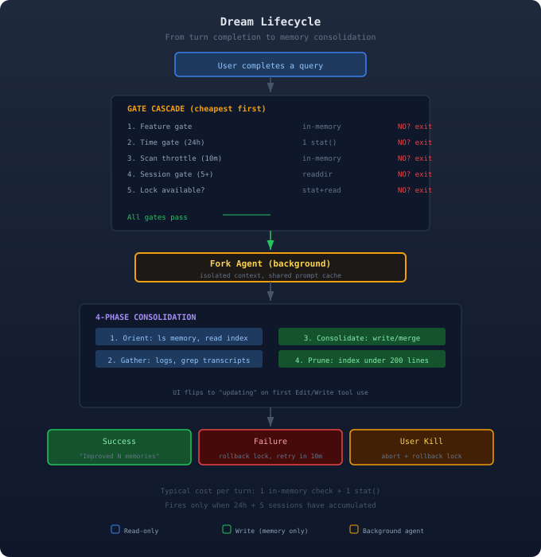

**TL;DR** Claude Code has a background agent called Dream that periodically reviews your recent sessions, merges scattered memory entries, resolves contradictions, and prunes stale facts. It runs as a forked subagent while you work, uses a file-based compare-and-swap lock for multi-process safety, and gates execution behind a five-level cascade designed to cost nearly nothing on most turns.

---

## The Problem: Ephemeral Intelligence

Every Claude Code session generates insight about your codebase, preferences, and debugging patterns. The memory system captures individual facts as they appear via per-turn extraction. But turn-level extraction is reactive: it saves facts one at a time without cross-session perspective.

Over time, this creates **memory drift**. Individual facts accumulate without organization. A preference saved in session 3 might be contradicted by session 7. Related facts scatter across separate files. The `MEMORY.md` index grows bloated.

Dream solves this by stepping back periodically to review all recent sessions holistically. The name mirrors biological sleep consolidation: short-term memories are merged into long-term knowledge during downtime.

---

## What Dream Actually Is

Dream is a background memory consolidation agent. After you accumulate enough sessions (default: 5 over 24 hours), it fires automatically as a forked subagent. It reviews recent conversation history, reorganizes your memory directory, and surfaces a quiet "Improved N memories" notification when done.

The feature lives in `services/autoDream/` (~500 lines) plus UI components in `tasks/DreamTask/`.



---

## The Gate Hierarchy

Dream checks whether to fire **after every turn**, but the check is designed to cost nearly nothing in the common case. Gates are ordered cheapest first. The moment one fails, execution returns:

| Gate | Cost |
|------|------|
| Feature flags on? | in-memory |
| 24h since last run? | 1 `stat()` |
| 10min since last scan? | in-memory |
| 5+ sessions touched? | `readdir` |
| Lock available? | `stat` + `read` |

The typical per-turn cost is **one flag check and one `stat()`** before returning. The expensive session scan only runs when the time gate has already passed.

### The Scan Throttle

A subtle edge case: when the time gate passes (>24h) but the session gate fails (not enough sessions), the lock `mtime` has not advanced. So the time gate passes again on the *next* turn, and the next.

Without mitigation, every turn would trigger a directory scan. The scan throttle remembers the last scan time in a closure and short-circuits if under 10 minutes:

```
sinceScan = Date.now() - lastScanAt
if sinceScan < 10min:
  return  // skip scan
lastScanAt = Date.now()
```

This is closure-scoped (inside `initAutoDream()`) rather than module-scoped, so tests get a fresh closure via `initAutoDream()` in `beforeEach` without module reload.

### Feature Gate

```
isGateOpen():
  if KAIROS mode   → false
  if remote mode    → false
  if !autoMemory    → false
  return autoDreamEnabled
```

KAIROS mode is excluded because it implements its own `/dream` skill through a different trigger model (nightly distillation of daily logs).

---

## Configuration

Dream uses a two-tier model: user settings override server-side defaults.

**Enable/disable** is resolved as:

```
autoDreamEnabled in settings.json?
  → use that value (hard override)
else
  → check GrowthBook tengu_onyx_plover
```

**Scheduling thresholds** (`minHours`, `minSessions`) come from the same GrowthBook flag with defensive per-field validation. Every value is type-checked, finite-checked, and positive-checked. A negative `minHours` would mean "always fire" and burn API tokens.

---

## The Lock: A File That Is Its Own Timestamp

Dream needs to prevent two things: concurrent consolidations across processes and re-triggering too soon. Both are solved with a single file:

```
~/.claude/projects/<hash>/memory/
  .consolidate-lock
    mtime → when last consolidated
    body  → PID of current holder
```

Most systems use separate lock and timestamp files. Here, the filesystem metadata carries scheduling info while file content carries concurrency info.

### Compare-and-Swap Acquisition

`tryAcquireConsolidationLock()` implements a CAS pattern:

```
1. stat() + readFile() in parallel
2. If held by live process → blocked
3. If dead PID or stale → reclaim
4. Write our PID
5. Re-read to verify we won the race
6. If PID mismatch → lost race, exit
```

Two processes reclaiming simultaneously: both write their PID. The last writer wins. The loser re-reads, sees a different PID, and returns `null`.

### Rollback

On fork failure or user kill, the lock `mtime` must rewind so the time gate passes again:

```
rollbackConsolidationLock(priorMtime):
  if priorMtime == 0:
    unlink(lock)       // restore no-file
  else:
    writeFile(lock, '') // clear PID
    utimes(lock, prior) // rewind mtime
```

The PID body is cleared because our process is still alive. Without clearing, we would look like we still hold the lock.

---

## The Consolidation Prompt

The dream agent follows four phases, structured to minimize wasted context:

### Phase 1: Orient

Survey the memory directory before making changes. `ls` the directory, read `MEMORY.md`, skim existing topic files. This prevents creating duplicates because the agent did not know a file existed.

### Phase 2: Gather Recent Signal

Sources in priority order:

1. **Daily logs** (highest signal-to-noise)
2. **Drifted memories** (facts contradicting current code)
3. **Transcript search** (narrow `grep` only)

The prompt explicitly constrains:

> "Don't exhaustively read transcripts. Look only for things you already suspect matter."

Session transcripts are large JSONL files. Reading them fully would blow through context limits. The agent uses targeted grep:

```bash
grep -rn "<term>" transcripts/ \
  --include="*.jsonl" | tail -50
```

### Phase 3: Consolidate

Write or update memory files. Key rules:

- Merge into existing files, do not duplicate
- Convert relative dates to absolute
- Delete contradicted facts at the source

### Phase 4: Prune and Index

`MEMORY.md` must stay under 200 lines and ~25KB. Each entry is one line:

```
- [Title](file.md) -- one-line hook
```

Remove stale pointers, demote verbose entries, add new memories, resolve conflicts.

---

## The Forked Agent

Dream does not spawn a separate process. It runs as a **forked subagent** in the same process with isolated state:

```
runForkedAgent({
  promptMessages: [prompt],
  cacheSafeParams: parentParams,
  canUseTool: autoMemPermissions,
  querySource: 'auto_dream',
  skipTranscript: true,
  overrides: { abortController },
  onMessage: progressWatcher,
})
```

### Isolation

The fork gets:

- Fresh file state cache (mutations do not propagate back)
- Independent `AbortController` (linked to parent but separately killable)
- Fresh skill/memory tracking
- No-op mutation callbacks for parent state

### Prompt Cache Sharing

The key optimization. The Anthropic API caches system prompts, tools, and message prefixes. If the fork sends the same prefix as the parent, it gets a cache hit.

`cacheSafeParams` captures the parent's system prompt, tools, and context messages. As long as these are byte-identical, the fork benefits from cached prompt processing. This is why `cacheSafeParams` is explicitly passed rather than reconstructed: any difference would invalidate the cache key.

### Tool Sandbox

| Tool | Permission |
|------|------------|
| Read, Grep, Glob | Unrestricted |
| Bash | Read-only only |
| Edit, Write | Memory directory only |
| Everything else | Denied |

The sandbox prevents the dream agent from modifying project code while allowing it to read whatever context it needs. Denied tool attempts fire analytics (`tengu_auto_mem_tool_denied`).

### Transcript Isolation

`skipTranscript: true` keeps dream's internal reasoning out of the session transcript. The only user-visible artifact is the "Improved N memories" inline system message.

---

## Task System: Making the Invisible Visible

Before task integration, dream was completely invisible. The task system surfaces it through three levels:

**Footer pill** — A simple `dreaming` label in the status bar. Minimal indicator.

**Background tasks dialog** (Shift+Down):

```
Memory consolidation
  reviewing 5 sessions       running
```

Phase flips to "updating" when the first Edit/Write tool use is detected.

**Detail view** (Enter on task) — Shows the last 6 turns from a 30-turn rolling buffer. Each turn displays agent reasoning and tool use count. The `x` key kills the dream.

### State Shape

```typescript
type DreamTaskState = {
  type: 'dream'
  phase: 'starting' | 'updating'
  sessionsReviewing: number
  filesTouched: string[]
  turns: DreamTurn[]  // max 30
  abortController?: AbortController
  priorMtime: number  // for rollback
}
```

The `priorMtime` is stashed at registration so the kill handler can rewind the lock without re-reading it.

### Kill Handler

Kill is idempotent: if the task is already terminal, state is unchanged and rollback is skipped. This prevents double-rollback if the kill races with natural completion.

---

## Error Handling

Three failure modes, each handled differently:

**User kill** — `abortController.signal.aborted` is true. Exit silently. `DreamTask.kill` already aborted the controller, rolled back the lock, and set `status: 'killed'`.

**Fork error** — Mark task failed, roll back the lock (so time gate passes on next turn), fire analytics. The scan throttle provides 10-minute natural backoff.

**Process crash** — Lock file has a dead PID. Next process reclaims after 1 hour (`HOLDER_STALE_MS`). No manual intervention needed.

---

## Auto-Dream vs Manual /dream

| Aspect | Auto | Manual |
|--------|------|--------|
| Trigger | 24h + 5 sessions | User runs `/dream` |
| Execution | Background fork | Foreground |
| Bash | Read-only | Full access |
| Transcript | Skipped | Recorded |
| Lock | Full CAS cycle | Stamps mtime only |

Both share `buildConsolidationPrompt()` for the 4-phase structure. Auto-dream appends read-only Bash constraints via an `extra` parameter.

When manual `/dream` runs, it calls `recordConsolidation()` to advance the lock `mtime`, preventing auto-dream from redundantly firing.

---

## Three Memory Mechanisms

Dream is one of three mechanisms:

**Turn-level extraction** (`extractMemories`) runs after every turn. Fast and reactive but lacks cross-session perspective. Creates the memory drift that Dream corrects.

**Auto-Dream** runs periodically (24h + 5 sessions). Reviews sessions holistically. Merges, deduplicates, resolves contradictions, prunes. Slow but high-quality.

**Daily logs** (KAIROS mode) writes append-only daily logs as events happen. The manual `/dream` distills these into structured memories. This is the KAIROS-specific path.

Turn-level extraction is note-taking during a meeting. Dream is reviewing your notes that evening.

---

## Crash Safety

| Scenario | Behavior |
|----------|----------|
| Crash mid-consolidation | Dead PID, reclaim in 1h |
| Two sessions dream at once | CAS: last writer wins |
| PID wraps and collides | 1h stale threshold guards |
| Kill then new turn fires | Rollback + 10m throttle |
| Fork fails, rollback fails | Full minHours delay |
| Memory dir missing | mkdir -p, created lazily |
| GrowthBook returns garbage | Defaults: 24h, 5 sessions |

---

## Design Decisions

**Why mtime instead of a database?** `stat()` is one of the cheapest filesystem operations. `utimes()` can rewind atomically for rollback. The file content (PID) carries orthogonal concurrency info. No extra persistence layer needed.

**Why closure-scoped state?** `lastSessionScanAt` lives inside the `initAutoDream()` closure. Tests get fresh state by calling `initAutoDream()` in `beforeEach` without module reload or global cleanup.

**Why only two UI phases?** The dream agent follows a 4-phase prompt, but parsing the phases would require fragile text matching. Instead, the phase flips on the first Edit/Write tool use. Robust and prompt-change-proof.

**Why read-only Bash?** The agent needs to scan transcripts and codebase but must never modify project code. Rather than blocking Bash entirely (losing `grep` and `ls`), the permission system checks `tool.isReadOnly()` per invocation.

**Why fire-and-forget?** Dream can take minutes. Blocking the user is unacceptable. Dream's output is not needed until a future session. Failure is recoverable via lock rollback. The user can monitor and kill via the tasks dialog.

**Why does scan throttle double as backoff?** After failure, lock rollback rewinds mtime. The time gate would pass immediately on the next turn. The 10-minute scan throttle provides natural backoff without a separate retry counter.

---

## Key Takeaways

1. **Gate cascade** makes the per-turn cost nearly zero: one flag check and one `stat()` in the common case.

2. **File-based CAS lock** solves both scheduling (mtime) and concurrency (PID body) with a single file.

3. **Forked subagent** runs in the same process with isolated state and shared prompt cache.

4. **4-phase prompt** structures the agent's work: orient, gather, consolidate, prune.

5. **Sandbox** restricts the agent to read-only Bash and memory-directory-only writes.

6. **Crash recovery** is automatic: dead PIDs are reclaimed after 1 hour with no manual intervention.

Dream is a case study in building reliable background agents. The gate hierarchy, CAS locking, and rollback mechanics are patterns applicable well beyond memory consolidation.
