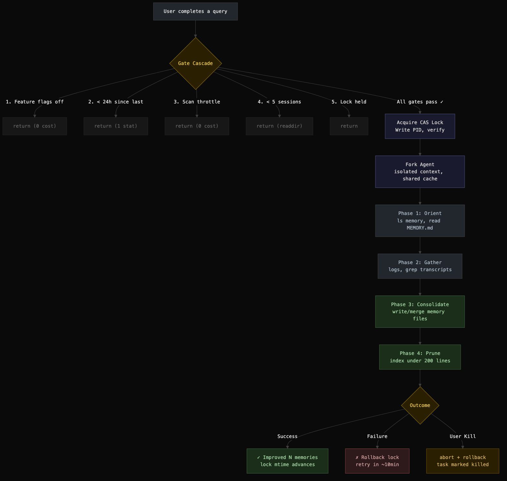

**TL;DR** While exploring Claude Code's source, we found a system called Dream: a background agent that consolidates memory the way biological sleep consolidates learning. It is a case study in building reliable background AI agents, and its patterns, gate cascades, file-based CAS locks, sandboxed forked subagents, point toward a future where AI tools maintain long-term knowledge autonomously.

---

## What We Found

While mapping Claude Code's 1300+ module codebase file by file, we stumbled on a directory that stopped us: `services/autoDream/`. About 500 lines of production TypeScript implementing something the codebase calls "Dream."

The name is not decorative. Dream is a **background memory consolidation agent** that mirrors biological sleep consolidation. When you are not actively prompting, it reviews your recent sessions, merges scattered memory entries, resolves contradictions, and prunes stale facts. The user sees nothing but a quiet "Improved N memories" message.

This is not documentation of an API. This is a case study of what we found in the source, what design patterns it reveals, and where those patterns lead.

---

## The Core Insight: AI Agents Need Downtime Too

Every Claude Code session generates insight about your codebase, preferences, and debugging patterns. The memory system captures these as individual facts via per-turn extraction. But reactive extraction creates a problem familiar to anyone who has taken notes in a meeting: the notes accumulate, contradict each other, and nobody goes back to organize them.

Dream is the "going back to organize" step. It fires automatically when enough new experience has accumulated (5 sessions over 24 hours) and performs what the source calls "memory surgery": merging related facts, resolving contradictions, pruning stale entries, and keeping the memory index within budget.

The biological metaphor runs deep. Dream:

- Runs during downtime, never blocking active work
- Reviews recent episodes holistically
- Consolidates ephemeral signal into durable storage
- Prunes and compresses aggressively
- Fires periodically, not continuously

This is the first AI coding tool we have seen that implements offline knowledge management as a first-class background process.



---

## Case Study: The Gate Cascade

The first engineering challenge: Dream fires after *every* turn, but most turns should cost nothing. The solution is a five-gate cascade ordered by cost:

| Gate | Cost |
|------|------|
| Feature flags on? | in-memory |
| 24h since last run? | 1 `stat()` |
| 10min since last scan? | in-memory |
| 5+ sessions touched? | `readdir` |
| Lock available? | `stat` + `read` |

The typical turn pays **one flag check and one `stat()`** before returning. The expensive session scan only runs when cheaper gates have already passed.

**What makes this worth studying:** This cascade pattern is general-purpose. Any background agent that triggers on user activity needs to answer "should I fire?" cheaply. The principle is to order checks by cost and bail at the first failure. The Dream implementation shows how to layer in-memory checks, filesystem checks, and cross-process coordination into a single cascade where the common case is nearly free.

### A Subtle Edge Case

When the time gate passes (>24h) but the session gate fails (not enough sessions yet), the lock `mtime` has not advanced. So the time gate passes again on the *next* turn. Without mitigation, every turn triggers a directory scan.

The solution: a closure-scoped scan throttle that remembers the last scan time and short-circuits if under 10 minutes have elapsed. This variable lives inside the `initAutoDream()` closure rather than at module scope, so tests get fresh state by calling `initAutoDream()` in `beforeEach` without module reload.

This is the kind of detail that separates production systems from prototypes: the interaction between independent gates creates emergent behavior that needs its own mitigation.

---

## Case Study: The File-Based CAS Lock

Dream needs multi-process safety. Multiple CLI sessions might try to consolidate simultaneously. The solution is elegant: **a single file where the mtime is the timestamp and the body is the PID**.

```
.consolidate-lock
  mtime → when last consolidated
  body  → PID of current holder (or empty)
```

Most systems use separate lock and timestamp files. Here, filesystem metadata carries scheduling info while file content carries concurrency info. One file, two orthogonal concerns.

### Compare-and-Swap Protocol

Acquisition follows a CAS pattern:

```
1. stat() + readFile() in parallel
2. If held by live process → blocked
3. If dead PID or stale → reclaim
4. Write our PID
5. Re-read to verify we won race
6. If PID changed → lost, exit
```

Two processes reclaiming simultaneously: both write. Last writer wins. The loser re-reads, sees a different PID, returns `null`.

### Rollback: Rewinding Time

On failure, the lock `mtime` must rewind so the time gate passes again:

```
rollbackConsolidationLock(priorMtime):
  if priorMtime == 0:
    unlink(lock)        // no-file state
  else:
    writeFile(lock, '') // clear PID
    utimes(lock, prior) // rewind mtime
```

**Why this pattern matters:** File-based CAS is underrated for single-machine coordination. No database, no IPC, no daemon process. `stat()` is one of the cheapest syscalls. `utimes()` can atomically rewind time for rollback. The file content carries orthogonal state. This pattern works anywhere you need lightweight cross-process coordination without infrastructure dependencies.

---

## Case Study: The Sandboxed Forked Agent

Dream does not spawn a separate process. It runs as a **forked subagent**: an isolated instance of the same Claude query loop, running in the same process with its own context, tool permissions, and abort controller.

```
runForkedAgent({
  promptMessages: [prompt],
  cacheSafeParams: parentParams,
  canUseTool: autoMemPermissions,
  querySource: 'auto_dream',
  skipTranscript: true,
  overrides: { abortController },
  onMessage: progressWatcher,
})
```

### The Sandbox

| Tool | Permission |
|------|------------|
| Read, Grep, Glob | Unrestricted |
| Bash | Read-only only |
| Edit, Write | Memory directory only |
| Everything else | Denied |

The dream agent can read your entire codebase and transcripts but can only write to the memory directory. Bash is restricted to `ls`, `grep`, `cat`, `stat`, and similar read-only commands via `tool.isReadOnly()` checks.

### Prompt Cache Sharing

The key optimization. The Anthropic API caches system prompts and message prefixes. If the fork sends the exact same prefix as the parent, it gets a cache hit.

`cacheSafeParams` captures the parent's system prompt, tools, and context messages and passes them explicitly rather than reconstructing them. Any byte difference would invalidate the cache key.

**Why this pattern matters:** Sandboxed forked agents are a powerful primitive. You get the full capability of the LLM query loop with controlled tool access, isolated state, and prompt cache sharing. Dream uses this for memory consolidation, but the same pattern could power code review agents, documentation agents, or any background task that needs LLM reasoning without risking side effects.

---

## The 4-Phase Consolidation Prompt

The dream agent's work is structured into four phases, each minimizing wasted context:

**Phase 1 (Orient):** Survey the memory directory. Read `MEMORY.md`. Skim topic files. This prevents duplicates.

**Phase 2 (Gather):** Collect recent signal from daily logs, drifted memories, and narrow transcript searches. The prompt explicitly constrains:

> "Don't exhaustively read transcripts. Look only for things you already suspect matter."

This is critical. Transcripts are large JSONL files. The agent uses targeted `grep`:

```bash
grep -rn "<term>" transcripts/ \
  --include="*.jsonl" | tail -50
```

**Phase 3 (Consolidate):** Write or update memory files. Merge into existing files, convert relative dates to absolute, delete contradicted facts at the source.

**Phase 4 (Prune):** Keep `MEMORY.md` under 200 lines and ~25KB. Remove stale pointers, demote verbose entries, resolve conflicts between files.

**What makes this worth studying:** The 4-phase structure is a pattern for any agent that needs to modify a knowledge base. Orient before acting (prevent duplicates), gather selectively (do not exhaust context), write incrementally (merge over create), and prune afterward (maintain budget constraints). These phases map naturally to any knowledge maintenance task.

---

## Crash Safety: Defense in Depth

The source reveals careful thinking about failure modes:

| Scenario | Behavior |
|----------|----------|
| Crash mid-consolidation | Dead PID, reclaim in 1h |
| Two sessions dream at once | CAS: last writer wins |
| PID wraps and collides | 1h stale threshold guards |
| Kill then new turn fires | Rollback + 10m throttle |
| Fork fails, rollback fails | Full minHours delay |
| Memory dir missing | mkdir -p, created lazily |
| GrowthBook returns garbage | Defaults: 24h, 5 sessions |

Every failure path has a recovery mechanism. The worst case is a delayed retry, never data corruption. The scan throttle doubles as backoff after failure: a failed dream rewinds the lock mtime, which would cause immediate re-triggering, but the 10-minute throttle provides natural spacing.

---

## Where This Pattern Leads

Dream is currently limited to memory consolidation. But the underlying primitives, gate cascades, CAS locks, sandboxed forked agents, prompt-structured knowledge work, are general-purpose. Here is where we see this heading:

### Background Code Review

A dream-like agent could periodically review recent commits against project conventions, architectural decisions, and known patterns. Instead of "Improved N memories," it would surface "Found 3 consistency issues in recent changes." The same gate cascade ensures it only fires when meaningful work has accumulated.

### Proactive Documentation

An agent that watches for code changes and updates relevant documentation. The sandbox pattern (read everything, write only to `docs/`) keeps it safe. The 4-phase prompt structure (orient on existing docs, gather code changes, update, prune) maps directly.

### Cross-Session Learning

Dream currently consolidates memory from a fixed project directory. Extend it to cross-project patterns: "This user always structures error handling this way," "This user prefers composition over inheritance." The gate hierarchy would add a project-count gate, and the consolidation prompt would look for transferable patterns.

### Multi-Agent Coordination

The CAS lock pattern could coordinate not just concurrent dreams but any set of background agents. An agent registry file (like the lock file but with an array of agent states) could prevent conflicting background work: "do not run the documentation agent while the refactoring agent is active."

### Graduated Autonomy

Dream currently runs fire-and-forget with a kill switch. A natural evolution: graduated autonomy levels. Level 1 (current): consolidate silently. Level 2: consolidate and propose changes that need approval. Level 3: take corrective action (fix a stale import, update a test). Each level uses the same forked agent with progressively wider tool permissions.

---

## Key Takeaways

1. **Background AI agents are viable today.** Dream proves that an LLM-powered agent can run reliably in the background with predictable costs and safe failure modes.

2. **Gate cascades make background agents cheap.** By ordering checks from cheapest to most expensive, the per-turn cost is nearly zero in the common case.

3. **File-based CAS is underrated.** A single file with mtime-as-timestamp and content-as-PID solves both scheduling and concurrency without infrastructure dependencies.

4. **Sandboxed forked agents are a powerful primitive.** Full LLM reasoning with controlled tool access, isolated state, and shared prompt cache.

5. **The 4-phase prompt structure generalizes.** Orient, gather, consolidate, prune maps to any knowledge maintenance task.

6. **Crash recovery should be automatic.** Dead PIDs are reclaimed, locks roll back, and the worst case is a delayed retry. No manual intervention needed.

Dream is small (500 lines) but architecturally significant. It demonstrates that AI tools can maintain persistent, evolving knowledge about their users and codebases, not just react to the current conversation. That is a meaningful step toward AI systems that genuinely learn from experience.
