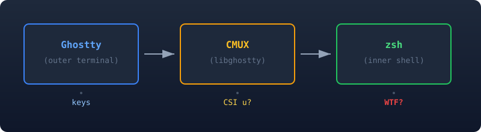
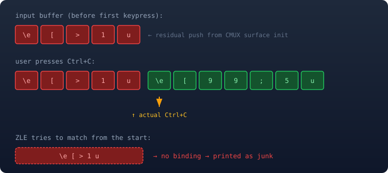
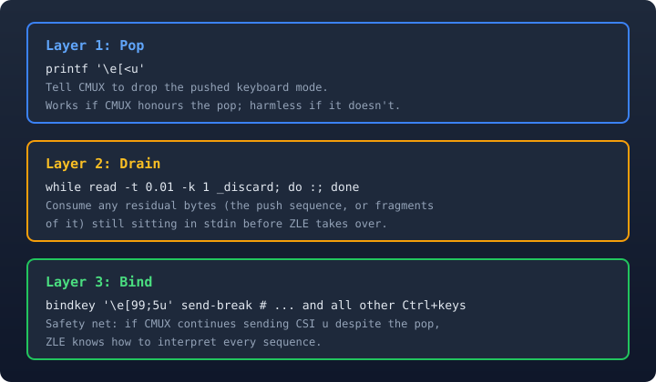

**TL;DR** — CMUX uses libghostty, which speaks the *kitty keyboard protocol*. That protocol encodes `Ctrl+C` as the escape sequence `\e[99;5u` instead of the single byte `0x03`. Zsh does not treat `\e[99;5u` as an interrupt, so it prints `^[[99;5u` literally. The fix has three layers: pop the keyboard mode CMUX pushes during surface creation, drain the leftover init bytes from the input buffer, and add `bindkey` mappings so zsh understands CSI u sequences.

---

## The Symptom

You're at a CMUX prompt. You press `Ctrl+C`. Instead of cancelling the current line, you get:

```
^[[99;5u^[[99;5u^[[99;5u%
❯ 9;5u9;5u9;5u
```

Every `Ctrl+<key>` combo produces similar garbage. In standalone Ghostty, the same keys work perfectly.

---

## Background: How Terminals Send Keystrokes

### The Legacy Model (VT100 era → today)

Traditional terminals collapse modified keys into a single byte. `Ctrl+C` becomes `0x03` (ASCII ETX). The kernel's tty line discipline watches for that byte and generates `SIGINT`. The model is simple and battle-tested, but it is also ambiguous: there is no way to distinguish `Ctrl+I` from `Tab`, `Ctrl+M` from `Enter`, or `Escape` from `Alt+[`.

### The Kitty Keyboard Protocol (CSI u)

The [kitty keyboard protocol](https://sw.kovidgoyal.net/kitty/keyboard-protocol/) solves the ambiguity by encoding every key press as:

```
CSI <unicode-codepoint> ; <modifiers> u
```

Where:

| Component | Meaning |
|-----------|---------|
| `CSI`     | `\e[` — the Control Sequence Introducer |
| codepoint | Unicode code point of the key (e.g. `99` = `c`) |
| modifiers | Bitmask (see appendix) |
| `u`       | Literal `u` — the sequence terminator |

So `Ctrl+C` becomes:

```
\e[99;5u
     │  │
     │  └─ modifier 5 = Ctrl
     └──── 99 = Unicode code point for 'c'
```

Applications opt in by sending a **push** escape (`\e[>flagsu`) and opt out with a **pop** (`\e[<u`). The protocol is a form of *progressive enhancement*: the terminal only sends CSI u sequences after the application asks for them.

### What Ghostty (Standalone) Does

Ghostty implements the full kitty keyboard protocol, but it only sends CSI u sequences to applications that **explicitly push** the keyboard mode. When your shell has not pushed, Ghostty falls back to legacy encoding. `Ctrl+C` becomes `0x03`, the kernel generates `SIGINT`, and everything works.

### What CMUX Does Differently

CMUX is a terminal multiplexer built on **libghostty** — the same rendering and input engine that powers standalone Ghostty, extracted as a library. CMUX sits between the outer terminal (Ghostty, iTerm2, whatever) and your shell:



The issue is on the inner side: CMUX's terminal emulation layer (libghostty) writes modified key presses to the inner pty using CSI u encoding even when the child application (zsh) never requested it. My working theory is that libghostty correctly advertises the kitty keyboard protocol to the *outer* terminal, but does not gate the *inner* encoding on an explicit push from the child shell.

The result is straightforward: zsh receives `\e[99;5u` on stdin, does not have a matching keybinding, and falls back to ZLE's (Zsh Line Editor) default behavior of printing the raw bytes.

---

## Why the Obvious Fix Doesn't Work

A common workaround floating around is to send the **pop** sequence on every prompt:

```zsh
_reset_kitty_kb() { printf '\e[<u' 2>/dev/null; }
add-zsh-hook precmd _reset_kitty_kb
```

The `\e[<u` sequence tells the terminal to pop one level of keyboard mode. In theory, that should revert input to legacy encoding.

In practice, it doesn't help because:

1. **CMUX may not honour the pop on the inner pty.** libghostty's keyboard mode is managed by the terminal surface, not the application stream. A pop sent *to* the inner pty may be interpreted as an *output* escape (drawn/ignored) rather than a mode change instruction.
2. **Even if the pop succeeds, CMUX may re-push on the next keypress.** The push/pop model assumes the *application* controls the mode. If the *terminal multiplexer* is the one enabling it, pops from the child are fighting an upstream force.
3. **Timing.** The pop runs on `precmd` — before the prompt. If the mode is re-enabled before the next keypress, you're back to square one.

---

## The Real Fix: A Three-Layer Defence

Keybindings alone solve most presses, but the **very first `Ctrl+C`** in a fresh CMUX surface can still print junk. Here is why, and here is the full fix.

### Why the First Press Leaks

When CMUX creates a terminal surface, libghostty sends a **push keyboard mode** escape (`\e[>1u`) into the pty. That sequence arrives as raw bytes on zsh's stdin. By the time the shell finishes initialising and ZLE starts reading input, those bytes are still sitting in the buffer:



The first `Ctrl+C` causes ZLE to consume those leftover bytes as garbage. The *second* press arrives on a clean buffer and matches `\e[99;5u` to `send-break` cleanly.

### The Fix: Pop + Drain + Bind

The complete solution runs in three layers during `.zshrc` init, before ZLE reads a single keypress:



Layer 1 alone is unreliable, as the previous section explained. Layer 3 alone still leaves the first-press bug. Together, the three layers eliminate the junk on every press, including the first.

### The Encoding Table

Every `Ctrl+<key>` combination has a deterministic CSI u encoding. The codepoint is the lowercase ASCII value, and the modifier is `5` (`Ctrl`):

| Key | Sequence | Widget |
|-----|----------|--------|
| ^A | `\e[97;5u` | `beginning-of-line` |
| ^B | `\e[98;5u` | `backward-char` |
| ^C | `\e[99;5u` | `send-break` |
| ^D | `\e[100;5u` | `delete-char-or-list` |
| ^E | `\e[101;5u` | `end-of-line` |
| ^F | `\e[102;5u` | `forward-char` |
| ^H | `\e[104;5u` | `backward-delete-char` |
| ^K | `\e[107;5u` | `kill-line` |
| ^L | `\e[108;5u` | `clear-screen` |
| ^N | `\e[110;5u` | `down-line-or-history` |
| ^P | `\e[112;5u` | `up-line-or-history` |
| ^R | `\e[114;5u` | `history-incremental-search-backward` |
| ^S | `\e[115;5u` | `history-incremental-search-forward` |
| ^T | `\e[116;5u` | `transpose-chars` |
| ^U | `\e[117;5u` | `kill-whole-line` |
| ^W | `\e[119;5u` | `backward-kill-word` |
| ^Y | `\e[121;5u` | `yank` |
| ^Z | `\e[122;5u` | custom: `kill -TSTP 0` |

### The Code

Add this to `~/.zshrc`:

```zsh
# CSI u / Kitty keyboard protocol fix
# (CMUX + libghostty)
#
# Three-part fix:
#  1. Pop the keyboard mode CMUX pushes
#  2. Drain residual init bytes from stdin
#  3. Register ZLE bindings for CSI u
if [[ -n "$CMUX_SOCKET_PATH" ]]; then
  # (1) Pop kitty keyboard mode
  printf '\e[<u' 2>/dev/null
  # (2) Drain leftover init sequences
  while read -t 0.01 -k 1 _d 2>/dev/null
  do :; done; unset _d
  # (3) Ctrl+key CSI u → ZLE widget
  bindkey '\e[97;5u'  beginning-of-line    # ^A
  bindkey '\e[98;5u'  backward-char        # ^B
  bindkey '\e[99;5u'  send-break           # ^C
  bindkey '\e[100;5u' delete-char-or-list  # ^D
  bindkey '\e[101;5u' end-of-line          # ^E
  bindkey '\e[102;5u' forward-char         # ^F
  bindkey '\e[104;5u' backward-delete-char # ^H
  bindkey '\e[107;5u' kill-line            # ^K
  bindkey '\e[108;5u' clear-screen         # ^L
  bindkey '\e[110;5u' down-line-or-history # ^N
  bindkey '\e[112;5u' up-line-or-history   # ^P
  bindkey '\e[114;5u' \
    history-incremental-search-backward # ^R
  bindkey '\e[115;5u' \
    history-incremental-search-forward  # ^S
  bindkey '\e[116;5u' transpose-chars      # ^T
  bindkey '\e[117;5u' kill-whole-line      # ^U
  bindkey '\e[119;5u' backward-kill-word   # ^W
  bindkey '\e[121;5u' yank                 # ^Y
  # ^Z: send SIGTSTP to foreground group
  _cmux_ctrl_z() { kill -TSTP 0; }
  zle -N _cmux_ctrl_z
  bindkey '\e[122;5u' _cmux_ctrl_z        # ^Z
fi
```

Then reload:

```bash
source ~/.zshrc
```

### Why This Works

1. **Layer 1 — Pop (`printf '\e[<u'`).** This runs during `.zshrc` init, before ZLE starts. It sends the kitty protocol pop sequence to CMUX's inner pty. If CMUX honours it, later keypresses revert to legacy encoding and the `bindkey` mappings become a safety net. If CMUX ignores it, layers 2 and 3 still cover the failure case.

2. **Layer 2 — Drain (`read -t 0.01 -k 1` loop).** This consumes any bytes already sitting in the input buffer, specifically the `\e[>1u` push sequence that CMUX wrote during surface creation. That removes the residual-buffer problem that caused the first-press junk. The `0.01` second timeout ensures we only drain what is already buffered without blocking shell startup.

3. **Layer 3 — Bind (`bindkey` mappings).** This registers every `Ctrl+key` CSI u sequence as a ZLE widget. Even if CMUX keeps sending CSI u encoding because the pop was ignored or re-pushed, ZLE can now match sequences like `\e[99;5u` to `send-break` reliably.

4. **`send-break` is the right prompt-time behavior.** The ZLE widget `send-break` aborts the current editor action or line parse, which is what users expect `Ctrl+C` to do at the prompt. It is not literally the tty driver's `SIGINT` path, but it restores the interactive shell behavior that matters here.

5. **The guard clause keeps it scoped.** The `if [[ -n "$CMUX_SOCKET_PATH" ]]` check ensures these bindings only activate inside CMUX sessions. Regular Ghostty, iTerm2, or SSH sessions are unaffected.

6. **Ctrl+Z needs special handling.** Unlike prompt-time editing widgets, `Ctrl+Z` is normally handled by the tty driver, which sends `SIGTSTP` to the foreground process group. In CSI u mode, the tty driver never sees `0x1a`, so we create a custom ZLE widget that sends `SIGTSTP` to process group `0` explicitly.

---

## What About Running Processes?

There is one important limitation: `bindkey` only works when ZLE is active, which usually means you are at the prompt typing. When a foreground process is running (`sleep 100`, `npm run dev`, and so on), ZLE is not reading input.

In the legacy model, the kernel's tty line discipline intercepts `0x03` *before* it reaches the process and generates `SIGINT`. With CSI u encoding, the tty driver sees `\e[99;5u`, which is not the configured `intr` character, so no signal is generated.

This points to a deeper architectural issue in CMUX/libghostty. The terminal emulator should translate `Ctrl+C` back to `0x03` when writing to the inner pty unless the child has explicitly opted into the kitty keyboard protocol via the push escape. That is the behavior standalone Ghostty appears to get right.

Until CMUX addresses this at the emulator level, the ZLE-level bindings fix the most common case: prompt interaction. If `Ctrl+C` still works for many running programs in CMUX, that suggests CMUX sometimes translates the key before writing it to the pty, but that path is separate from the prompt-time ZLE fix this post is focused on.

---

## Appendix: The CSI u Modifier Bitmask

If you need to extend this for other modifier combos:

| Modifier Value | Keys Held          |
|----------------|--------------------|
| 2              | Shift              |
| 3              | Alt (Option)       |
| 4              | Shift + Alt        |
| 5              | Ctrl               |
| 6              | Ctrl + Shift       |
| 7              | Ctrl + Alt         |
| 8              | Ctrl + Alt + Shift |

For example, `Ctrl+Shift+C` would be `\e[99;6u`. To bind it:

```zsh
bindkey '\e[99;6u' some-widget  # Ctrl+Shift+C
```

---

*Fix tested with CMUX (libghostty) inside Ghostty, zsh 5.9, macOS Sequoia.*
