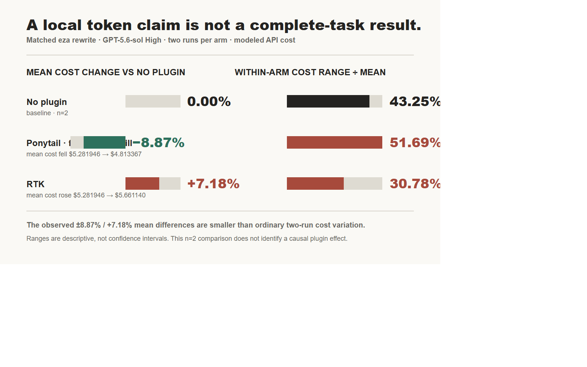

**TL;DR** A claim such as “90% fewer tokens” is not yet a useful coding-agent cost claim. It may measure only a local rewrite, ignore retries, and say nothing about whether the task completed. In Tura's small matched-run experiment, the practical unit was total cost per *verified completed task*—including elapsed time and recovery work. The results are useful evidence, but with two runs per arm they are not causal proof.

I maintain Tura and its benchmark corpus. This is an explicitly disclosed engineering report, not an independent review. The source analysis, raw artifacts, and limitations are linked below.

---

## Choose the denominator before celebrating a reduction

There are several legitimate measurements that teams routinely collapse into one “token savings” number:

| Measurement | What it can show | What it misses |
| --- | --- | --- |
| Local input tokens | Compression at one request boundary | Retries, output, and task result |
| Total model tokens | Model workload | Price weights and human recovery |
| Billed API cost | Spend for a run | Whether the run completed |
| Cost per verified completion | Engineering value for the queue | Requires a completion definition |

The final row is the decision metric. If an agent emits a compact request but needs another attempt, a manual repair, or never produces a verified patch, the token screenshot is not the outcome.

## The token ledger and the money ledger are different

The 140-run ledger used in the source analysis separates token volume from billed-cost composition. Cached input accounts for much of the volume; uncached input and output have a different relationship to price.

This does not mean tokens are irrelevant. It means a headline needs the rest of the bill and a task result beside it. A runner dashboard should record the following for each task shape:

1. success or a reproducible failure;
2. billed cost across all attempts;
3. elapsed time and agent rounds;
4. retry and recovery count; and
5. repeat-run spread.

## A tiny matched experiment can still teach the right caution

The source compared a baseline workflow and a token-saving rewrite across two matched runs per arm. The variance chart is more informative than a single best-case percentage because it makes the repeat-count limit visible.

Two runs are enough to expose a workflow trade-off and suggest a follow-up experiment. They are not enough to attribute a causal improvement to a plugin, framework, or prompt transformation. The safe claim is narrow: local compression did not by itself establish a cheaper completed coding task.

## A review checklist for agent cost claims

Before adopting a “saving” tool, I would ask:

| Question | Evidence to request |
| --- | --- |
| Did the task complete? | Test output, reviewable diff, or explicit failure label |
| What does the result cost? | Total billed cost for every attempt |
| Was it repeated? | Run count plus median/range, not one best run |
| Did the workflow change? | Tool calls, retries, and human repair time |
| Is the comparison fair? | Same task, model setting, success definition, and stopping rule |

That checklist is intentionally less exciting than a percentage badge. It is also much harder to game.

## Reproduce or challenge this result

- Full analysis, data tables, and limitations: https://turaai.net/blog#token-saving-plugins-are-mostly-stupid-idea
- Tura benchmark scripts and public artifacts: https://github.com/Tura-AI/tura

If you benchmark an agent optimization, please publish the failures and repeat counts beside the savings claim. I would particularly like to see whether the result holds when cost is normalized by *verified completed task* rather than by one compressed request.
