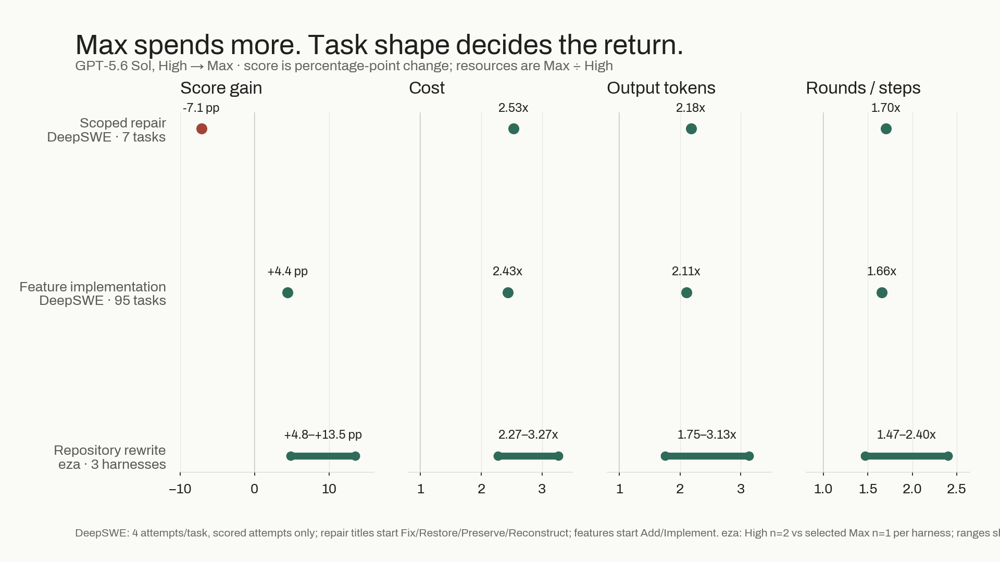
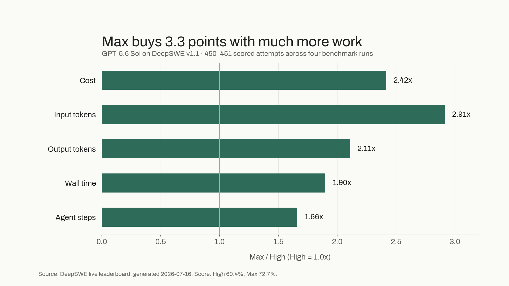
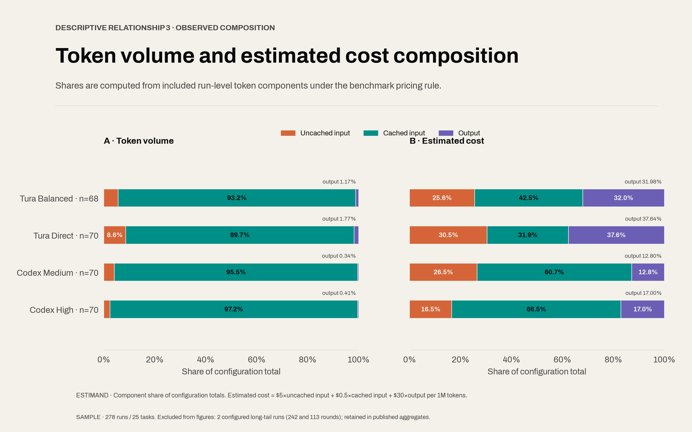

**TL;DR** I stopped asking whether GPT-5.6 Sol Max is "worth it" in the abstract. In a 113-task coding-agent dataset, High was the sensible default for bounded fixes. Max earned its higher budget when the agent had to discover an unfamiliar path through a rewrite, migration, or new build. The useful benchmark result is a routing rule, not one blended average.

This is a report from Tura's maintained benchmark corpus. I maintain Tura, so treat it as an openly disclosed engineering analysis rather than an independent review. The source data, scripts, and limitations are linked at the end.

---

## The problem with a single average

Agent benchmarks often present one pass rate and one total price. That hides the decision a developer actually has to make before starting work: *how much search, revision, and tool-use runway does this task need?*

For an isolated bug, the answer is usually "not much." The agent already has a narrow failure signal and a small patch surface. Paying for extra exploratory rounds can be wasteful.

For a rewrite or greenfield build, the agent must find conventions, test hypotheses, correct its plan, and often revisit earlier choices. In that setting, a cheaper run that stops before the path is found is not cheap in the completed-task denominator.



The chart above is why I would not route all coding work to either setting. Task shape changes what an extra agent round is worth.

## A practical routing rule

| Work entering the queue | Start with | Escalate when |
| --- | --- | --- |
| Bounded bug or test failure | High | The agent cannot identify a local cause after one focused investigation |
| Small feature in an established module | High | The design crosses unfamiliar packages or test contracts |
| Rewrite or migration | Max | — |
| New project / ambiguous brief | Max | — |

This is deliberately operational. It is not a claim that Max "wins" every evaluation. It is a way to choose a budget before a coding agent burns tokens in the wrong search regime.

## Why DeepSWE-style tasks change the economics

The expensive case is not simply a long answer. It is a task where the agent must make and test multiple implementation decisions. In the benchmark data, the DeepSWE-style slice shows the overhead of Max relative to High:



That cost premium is real. The reason to pay it is only that it can purchase useful iteration on a task that needs it. If a task is already bounded, the same additional search may have little marginal value.

## Token volume is not the cost decision

Another common mistake is to use total tokens as a proxy for all engineering cost. The 140-run cost ledger below separates token volume from billed-cost composition. Cached input dominates volume, while uncached input and output matter disproportionately to price.



So the dashboard I want for an agent workflow includes more than tokens:

1. verified successful tasks per task shape;
2. total billed cost per completed task;
3. elapsed time and agent rounds;
4. retries and recoveries;
5. variance across repeated runs.

The final item matters. A cheap single run can be misleading if the next identical run takes a different route. In the eza rewrite experiment cited below, each arm was run only twice. That sample is useful for showing variance and workflow trade-offs, but it is not enough to make a causal claim about any plugin or model setting.

## What I would change in an agent runner

I would expose a small pre-flight choice instead of a global model toggle:

```text
task shape: bounded-fix | feature | rewrite | new-build
budget:     High by default; Max for rewrite/new-build
escalation: one failed focused investigation -> Max
```

That makes the policy reviewable. It also makes it possible to compare routes using a completed-task metric rather than rewarding the most impressive token-reduction screenshot.

## Reproduce or challenge the rule

- Full analysis and task-shape tables: https://turaai.net/blog#is-gpt-5-6-sol-max-worth-it
- Tura source, benchmark artifacts, and scripts: https://github.com/Tura-AI/tura

If you run a similar agent benchmark, I would be most interested in the task labels you use and whether a different escalation threshold improves completed-task cost. Please include repeat counts and failures, not only the best run.
